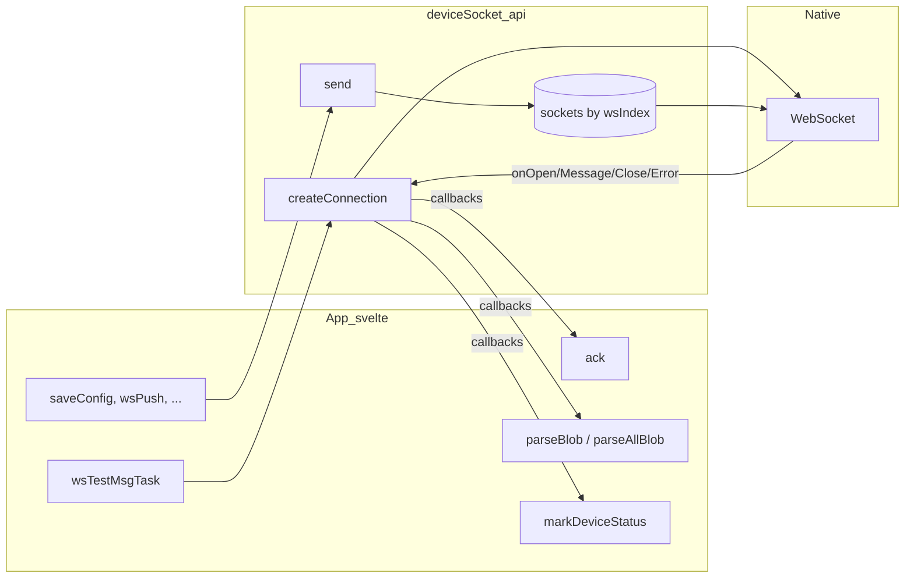
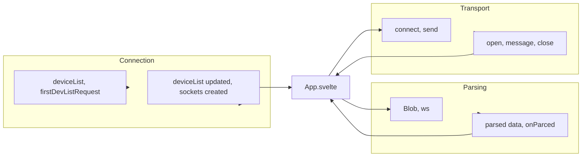
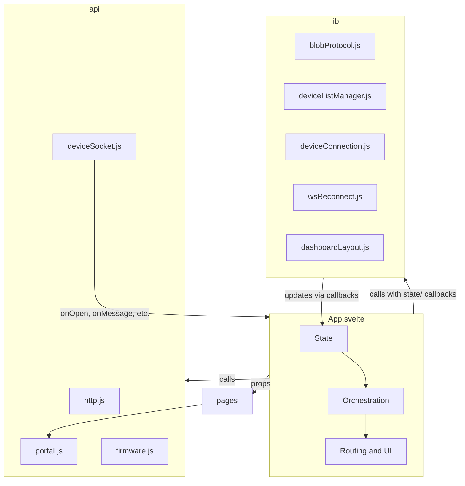

## Бэкенд (референс, не менять)

Интерфейс **IoTManagerWeb** работает в паре с прошивкой устройств — проект **IoTManager** (backend). При непонятностях по протоколу или форматам данных смотреть бэкенд как референс. **Бэкенд в рамках этого рефакторинга не меняем.**

- **Путь к проекту**: `../IoTManager` относительно IoTManagerWeb (или абсолютно: `/Users/dmitry/Documents/Database/IoTManagerProject/personal/IoTManager`).
- **Главный файл протокола WebSocket**: `IoTManager/src/WsServer.cpp`
  - Обработка входящих текстовых команд (`headerStr` до `|`): страницы `/|`, `/config|`, `/connection|`, `/list|`, `/system|`, `/profile|`; команды `/params|`, `/charts|`, `/gifnoc|`, `/tuoyal|`, `/oiranecs|`, `/sgnittes|`, `/mqtt|`, `/scan|`, `/devlist|`, `/tsil|`, `/control|`, `/tst|`, `/order|` и др.
  - Ответ на **/tst|**: отправка строки **/tstr|** (WStype_TEXT) — на фронте обрабатывается как единственное входящее string-сообщение.
  - Отправка данных клиенту: **sendFileToWsByFrames(filename, header, ...)** — бинарные фреймы с 6-символьным заголовком (itemsj, widget, config, scenar, settin, layout, params, devlis, prfile, otaupd, charta и т.д.); **sendStringToWs(header, payload, num)** — тот же формат «header|0012|payload» отправляется как **binary** (sendBIN), не текст. На фронте всё приходит как Blob, кроме явного ответа "/tstr|".
- **Модули логирования (графики)**: в `IoTManager/src/modules/virtual/Loging/`, `Loging2/`, `Loging3/`, `LogingDaily/`, `LogingHourly/` — формирование и отправка **charta** (sendFileToWsByFrames) и **chartb** (sendStringToWs). Формат и порядок полей на фронте должны совпадать с бэкендом.
- **Формат экспорта конфигурации** (mark "iotm", разделитель "scenario=>") используется и в примерах конфигов бэкенда: например `IoTManager/src/modules/exec/Buzzer/export.json`, примеры в modules с `scenario=>` в JSON.
- **Данные для тестов/сверки**: `IoTManager/data_svelte/` — config.json, items.json, widgets.json, layout.json, scenario.txt, settings.json и т.д.

При рефакторинге веб-интерфейса сохранять совместимость с тем, что отправляет и ожидает этот бэкенд; при сомнениях сверяться с `WsServer.cpp` и модулями Loging*.

---

## Контекст (что сейчас важно не сломать)

- **HTTP-запросы** разбросаны по `App.svelte` и страницам:
  - `App.svelte`: `getUser`, `getModInfo`, `getProfile` (portal/compiler) и `getVersionsList` (ver.json).
  - `pages/Login.svelte`, `pages/Profile.svelte`, `pages/Config.svelte`.
- **WebSocket к устройствам** — многослойная логика в `App.svelte` (см. раздел «Слои WebSocket» ниже).
- **Архитектурный каркас**: `App.svelte` — shell + роутинг (tinro) + прокидывание props в страницы.

---

## Бэкапы перед рефакторингом (первый шаг)

Перед любыми изменениями создать копии файлов, чтобы при потере контекста можно было сверяться с оригиналом.

- **Папка**: `_backup_refactor/` в корне проекта (или `src/_backup_refactor/`), добавить в `.gitignore` при желании не коммитить бэкапы.
- **Файлы для копирования**:
  - `src/App.svelte` (главный файл с протоколом и состоянием)
  - `src/main.js`
  - `src/pages/Config.svelte`, `Connection.svelte`, `Dashboard.svelte`, `List.svelte`, `Login.svelte`, `Profile.svelte`, `System.svelte` (страницы с логикой и/или fetch)
  - `src/widgets/Chart.svelte`, `Input.svelte`, `Range.svelte`, `Toggle.svelte`, `Anydata.svelte`
  - `src/components/Alarm.svelte`, `Card.svelte`, `Modal.svelte`, `ModalPass.svelte`, `Progress.svelte`
- **Цель**: не потерять контекст; при сомнениях сверять логику/форматы с бэкапом.

---

## Критичная цепочка: первое устройство и список устройств (не ломать)

Ключевой сценарий: приложение открыто с текущего устройства (один известный IP); по первому подключению запрашивается список всех устройств, затем подключаемся к каждому из них. Порядок и условия менять нельзя.

### Исходное состояние

- **deviceList** при инициализации содержит один элемент: `{ name: "--", id: "--", ip: myip, ws: 0, status: false }` (myip = document.location.hostname или при devMode фиксированный IP). [App.svelte L99–108]
- **firstDevListRequest = true** выставляется в **onMount** перед вызовом **connectToAllDevices()**. [L196, L198]

### Шаг 1: Подключение только к первому устройству

- **connectToAllDevices()** обходит deviceList, для каждого устройства с `status === false || undefined` вызывает **wsConnect(i)** и **wsEventAdd(i)**. Изначально в списке только индекс 0 — подключается один WebSocket к myip:81. [L228–236]
- В обработчике **open** сокета (в wsEventAdd): если **firstDevListRequest && ws === 0**, отправляется **wsSendMsg(ws, "/devlist|")**. Запрос списка устройств уходит только один раз и только с первого подключённого сокета (ws === 0). [L297–298]

### Шаг 2: Приём списка и обновление deviceList

- Устройство отвечает blob с заголовком **"devlis"**, в payload — JSON-массив устройств (name, id, ip, ws, status, …). [L429–434]
- В **parseBlob** при `header === "devlis"`: **incDeviceList = out.json**, затем вызывается **initDevList()**. [L432–436]
- **initDevList()**: [L695–711]
  - Если **firstDevListRequest** — вызывается **devListOverride()**: deviceList полностью заменяется на incDeviceList, **sortList(deviceList)**, затем **deviceList[0].status = true** (чтобы не переподключаться к уже подключённому первому устройству).
  - Иначе — **devListCombine()**: слияние deviceList и incDeviceList по IP (combineArrays), sortList.
  - **firstDevListRequest = false**, затем снова **connectToAllDevices()**.

### Шаг 3: Подключение ко всем устройствам из списка

- После devListOverride/devListCombine в **deviceList** уже все IP. **connectToAllDevices()** вызывается снова: для устройств с `status === false` создаются новые сокеты (индексы 1, 2, …); устройство с индексом 0 пропускается, т.к. **deviceList[0].status** уже true. [L714–718, L228–236]

### Что при рефакторинге сохранить

- Условие отправки `/devlist|` только при **firstDevListRequest && ws === 0** в обработчике **open**.
- Обработку blob **"devlis"** только в parseBlob (для выбранного устройства), вызов **initDevList()** и внутри него **devListOverride** при первом запросе, **devListCombine** при последующих.
- Присвоение **deviceList[0].status = true** в devListOverride после подстановки списка — без этого произойдёт повторное подключение к первому устройству.
- Последовательность: onMount → firstDevListRequest=true → connectToAllDevices() → open(ws=0) → /devlist| → devlis → initDevList → devListOverride/devListCombine → connectToAllDevices() снова. Не разрывать цепочку и не менять порядок.

**После рефакторинга** эта логика должна жить в **lib/deviceConnection.js** (connectToAllDevices, createOpenHandler, handleDevListReceived) и **lib/deviceListManager.js** (initDevList, devListOverride, devListCombine); App только передаёт зависимости и вызывает экспорты этих модулей.

---

## Страница списка устройств (List) — не ломать

Страница [src/pages/List.svelte](src/pages/List.svelte) отображает **deviceList**, управляет добавлением/удалением устройств и сохранением списка на устройство. При рефакторинге сохранять поведение и контракт с App.

### Данные и пропсы из App

- **deviceList** — массив устройств (name, id, ip, ws, status, ping, fv и т.д.); таблица строится по нему, при удалении строки вызывается **deviceList.splice** и **deviceList = deviceList**.
- **settingsJson** — для режима (udps: авто/ручной), заголовок карточки и кнопка «Добавить устройство» зависят от **settingsJson.udps**.
- **showInput**, **newDevice** — форма добавления устройства (name, ip, id); при сохранении вызывается **addDevInList()** (в App добавляет newDevice в incDeviceList, devListCombine, connectToAllDevices), затем **saveList()** (отправка **/tsil|** с deviceList).
- **saveList**, **saveSett**, **sendToAllDevices**, **applicationReboot** — передаются с App; **devListOverride** передаётся (резерв/будущее использование).
- **percent** — для прогресс-бара (таймер реконнекта).

### Критичная логика на странице

- **deleteLineFromDevlist(i)** — удаление устройства из списка по индексу (splice), не удалять первую строку (i > 0 в шаблоне для кнопки удаления). [L23–32, L95–96]
- **onModeChange()** — при переключении udps (авто/ручной): saveSett(), applicationReboot(). [L34–38, L132]
- **onSaveList()** — в ручном режиме: при showInput вызов addDevInList() и при успехе saveList() и applicationReboot(); без showInput — только saveList() и applicationReboot(). В авторежиме — saveList() и alert о переходе в ручной режим. [L41–64]
- **saveList()** в App отправляет **/tsil|** с JSON deviceList (со статусами, сброшенными в false). [App.svelte L898–906]

### Что при рефакторинге сохранить

- Отображение deviceList в таблице (ws+1 как №, name, ip, id, fv, status, ping) и реактивность при изменении deviceList.
- Не ломать вызовы addDevInList, saveList, saveSett, sendToAllDevices, applicationReboot и передачу devListOverride. Сохранение списка на устройство (/tsil|) и логика ручной/авто режима (udps) должны работать как сейчас.

---

## Данные не в blob и системные команды

Часть обмена с устройством идёт **текстовыми (string) сообщениями**, а не бинарным blob. При рефакторинге разделение string/blob и набор команд менять нельзя.

### Входящие данные не в blob (WebSocket message, string)

Обработка в `socket[ws].addEventListener("message", ...)` (App.svelte L312–330):

- **Только один тип строки обрабатывается**: `event.data === "/tstr|"`.
  - Условие: `typeof event.data === "string"` и точное совпадение `data === "/tstr|"`.
  - Действие: вызов **ack(ws, true)** — снятие таймаута ожидания ответа, запись ping. Это ответ устройства на команду **/tst|** (heartbeat).
- Все остальные входящие данные обрабатываются только если `event.data instanceof Blob` (parseBlob/parseAllBlob). Строковые сообщения, отличные от "/tstr|", сейчас **игнорируются** (не ломать: не добавлять лишнюю обработку и не удалять проверку на "/tstr|").

### Исходящие системные команды (что отправляется по WebSocket)

Все отправки через **wsSendMsg(ws, msg)** или **sendToAllDevices(msg)**. Формат сообщения — строка; для команд с телом после `|` идёт JSON или текст без изменения формата.

| Команда | Кто вызывает | Назначение |

|---------|----------------|------------|

| **currentPageName** (напр. `/\|`, `/config|`) | handleNavigation, open handler | Запрос данных страницы |

| `/devlist|` | open (только ws===0, firstDevListRequest) | Запрос списка устройств |

| `/tst|` | wsTestMsgTask (heartbeat) | Проверка живости; ответ — "/tstr" |

| `/params|` | sortingLayout(ws) | После layout: запрос params |

| `/charts|` | updateAllStatuses(ws) | После params: запрос данных графиков |

| `/tuoyal|` + JSON | saveConfig, saveMqtt | Layout виджетов (reversed "layout") |

| `/gifnoc|` + JSON | saveConfig | Конфиг (reversed "config") |

| `/oiranecs|` + scenarioTxt | saveConfig | Сценарий (reversed "scenario") |

| `/sgnittes|` + JSON | saveSett, saveMqtt | Настройки (reversed "settings") |

| `/tsil|` + JSON | saveList | Список устройств (reversed "list") |

| `/clean|` | cleanLogs | Очистка логов на устройстве |

| `/mqtt|` | saveMqtt | Применение MQTT/настроек |

| `/control|` + key + "/" + status | wsPush (dashboard) | Управление виджетом по topic key |

| `/scan|` | ssidClick | Сканирование Wi‑Fi |

| `/reboot|` | rebootEsp | Перезагрузка устройства |

| `/update|` + path | updateBuild | OTA-обновление по path |

| `/rorre|` + JSON | cancelAlarm | Сброс ошибки (reversed "error") |

| `/order|` + JSON | moduleOrder (Config) | Порядок/параметры модуля |

При выносе транспорта в api контракт «строка msg без изменения» сохранить; не менять разделитель `|` и имена команд.

---

## Экспорт конфигураций (детали формата)

Чтобы при рефакторинге не сломать совместимость файлов и портала.

### Экспорт (createExportFile, Config.svelte)

- **Объект**: `exportJson = { mark: "iotm", config: configJson }`. Поле **config** — текущий массив конфигурационных элементов (как в таблице).
- **Строка для файла**: сначала **syntaxHighlight(JSON.stringify(exportJson))** — т.е. JSON с отступами (pretty-print), затем конкатенация **"\n\nscenario=>"** и **scenarioTxt** (сырой текст сценария, может содержать переносы строк и любые символы).
- **Файл**: сохраняется как `export.json`, MIME при сохранении — `application/json` (фактически содержимое — JSON часть + литерал `\n\nscenario=>` + текст). Имя файла и разделитель "scenario=>" не менять.

**syntaxHighlight**: парсит JSON и переформатирует с отступами (4 пробела), экранирует HTML в строках для безопасного вывода; при экспорте используется только переформатирование. Импорт читает файл как текст и парсит только часть до "scenario=>".

### Импорт (реакция на выбор files)

- Прочитать файл как текст (files[0].text()).
- Проверки по порядку: (1) в тексте есть подстрока **"scenario=>"**; (2) часть **до** "scenario=>" (jsonPart) парсится как JSON (IsJsonParse); (3) в объекте есть **mark === "iotm"**. Иначе — alert и выход.
- При подтверждении пользователем (window.confirm): **configJson = json.config**, **scenarioTxt =** часть текста **после** "scenario=>" (deleteBeforeDelimiter). Очистка полей перед присвоением (configJson = [], scenarioTxt = "") для реактивности.
- **selectToMarker(str, "scenario=>")** — строка до первого вхождения "scenario=>"; **deleteBeforeDelimiter(str, "scenario=>")** — строка после "scenario=>". Один и тот же разделитель при экспорте и импорте.

### Публикация на портал (makePost)

- Тело: объект с полями category, topic (ru/en), text (ru/en), **config**, **scenario**, gallery, type "iotmpost", username. Конфиг и сценарий те же, что в экспорте. Ответ портала: при успехе открывается ссылка с id и token в query. Отдельно от файлового экспорта, но те же config/scenario — не менять структуру полей.

---

## Слои WebSocket (полная инвентаризация)

Перед любым выносом WS в api нужно учитывать все слои и зависимости.

### Слой 1 — Транспорт (создание, события, send)

- **Хранение**: массив `socket[]`, индекс = `device.ws` (то же, что индекс в `deviceList`).
- **wsConnect(ws)** (L269–277): `getIP(ws)` по `deviceList` → `socket[ws] = new WebSocket("ws://" + ip + ":81")`, затем `socket.binaryType = "blob"` (сейчас вешается на массив; корректнее `socket[ws].binaryType = "blob"`).
- **getIP(ws)** (L280–287): обход `deviceList`, возврат `device.ip` при `device.ws === ws`.
- **wsEventAdd(ws)** (L290–345): вешает на `socket[ws]`:
  - **open**: `markDeviceStatus(ws, true)`; при `firstDevListRequest && ws === 0` → `wsSendMsg(ws, "/devlist|")`; при `currentPageName === "/|"` → `wsSendMsg(ws, currentPageName)`; иначе при `ws === selectedWs` → `sendCurrentPageNameToSelectedWs()`.
  - **message**: строка `"/tstr|"` → `ack(ws, true)`; `Blob` → если `ws === selectedWs` то `parseBlob(data, ws)`, если `currentPageName === "/|"` то `parseAllBlob(data, ws)`.
  - **close** / **error**: `markDeviceStatus(ws, false)`.
- **wsSendMsg(ws, msg)** (L1085–1092): если `socket[ws] && socket[ws].readyState === 1` → `socket[ws].send(msg)`.

Зависимости слоя 1 от состояния App: `deviceList`, `selectedWs`, `currentPageName`, `firstDevListRequest`; вызовы в App: `markDeviceStatus`, `wsSendMsg`, `sendCurrentPageNameToSelectedWs`, `parseBlob`, `parseAllBlob`, `ack`.

### Слой 2 — Реконнект и heartbeat

- **wsTestMsgTask()** (L1037–1063): каждую секунду (`setTimeout(wsTestMsgTask, 1000)`); уменьшает `remainingTimeout`; при 0 обходит `deviceList`: если устройство offline → `wsConnect(ws)`, `wsEventAdd(ws)`; иначе → `wsSendMsg(ws, "/tst|")`, `ack(ws, false)`.
- **ack(ws, st)** (L1065–1083): при `st === false` — ставит таймаут `waitingAckTimeout` (18 с), по срабатыванию вызывает `markDeviceStatus(ws, false)`; при `st === true` — снимает таймаут, считает `ping[ws]`, пишет `deviceList[i].ping`.

Зависимости: `deviceList`, `socket`, `reconnectTimeout`, `remainingTimeout`, `preventReconnect`, `rebootOrUpdateProcess`, `socketConnected`, `percent`, `showAwaitingCircle`; массивы `ackTimeoutsArr`, `startMillis`, `ping`.

### Слой 3 — Бинарный протокол (парсинг Blob)

Формат: 6 байт заголовок (текст), 4 байта размер (текст), затем payload. Вспомогательные функции: **getPayloadAsJson(blob, size, out)**, **getPayloadAsTxt(blob, size)**, **getJsonAsJson(blob, size, out)** (L565–595).

- **parseBlob(blob, ws)** (L347–474): по заголовку пишет в состояние App и в `parsed.*`; в конце вызывает **onParced()**.
  - Заголовки: `itemsj` → itemsJson; `widget` → widgetsJson; `config` → configJson; `scenar` → scenarioTxt; `settin` → settingsJson; `ssidli` → ssidJson; `errors` → errorsJson; `devlis` → incDeviceList + **initDevList()**; `prfile` → flashProfileJson; `otaupd` → otaJson; `corelg` → **addCoreMsg(txt)**.
- **parseAllBlob(blob, ws)** (L476–563): по заголовку обновляет layout/params и вызывает колбэки.
  - `status` → **updateWidget(statusJson)** (обновляет `layoutJson[i]` по topic).
  - `layout` → **combineLayoutsInOne(ws, devLayout)** → дополняет `layoutJson`, затем **sortingLayout(ws)** → в конце `wsSendMsg(ws, "/params|")`.
  - `params` → мержит в `paramsJson`, **updateAllStatuses(ws)** (обход layoutJson + `wsSendMsg(ws, "/charts|")`), **onParced()**.
  - `charta` / `chartb` → **apdateWidgetByArray(...)** (обновление `layoutJson` по topic, накопление массивов).

Цепочки из парсеров: **initDevList()** → devListOverride/devListCombine → **connectToAllDevices()**; **sortingLayout** → wsSendMsg; **updateAllStatuses** → wsSendMsg; **onParced()** → getVersionsList, getModInfo, getProfile, pageReady.*.

### Слой 4 — Использование WS на уровне приложения

Вызовы **wsSendMsg** / **sendToAllDevices** из: навигация (handleNavigation, sendCurrentPageNameToSelectedWs), saveConfig/saveSett/saveList/saveMqtt/cleanLogs, wsPush (dashboard), rebootEsp, updateBuild, cancelAlarm, ssidClick, moduleOrder, ListPage (sendToAllDevices), wsTestMsgTask, sortingLayout, updateAllStatuses.

Команды, уходящие по WS: `currentPageName` (страница), `/devlist|`, `/tst|`, `/params|`, `/charts|`, `/tuoyal|...`, `/gifnoc|...`, `/oiranecs|...`, `/sgnittes|...`, `/tsil|...`, `/clean|`, `/mqtt|`, `/control|key/status`, `/scan|`, `/reboot|`, `/update|path`, `/rorre|...`, `/order|...`.

---

## Графики (charts): данные, протокол, костыли

Полная совместимость с серверной частью обязательна — форматы менять нельзя.

### Цепочка запросов

1. После прихода **layout** (parseAllBlob): `combineLayoutsInOne` → `sortingLayout(ws)` → отправка `**/params|**`.
2. После прихода **params** (parseAllBlob): мерж в `paramsJson`, **updateAllStatuses(ws)** (подставляет значения из paramsJson в `layoutJson[i].status` по topic), затем отправка `**/charts|**`.
3. Устройство отвечает пакетами с заголовками **charta** или **chartb**; данные попадают в `layoutJson[i].status` по совпадению **topic** через **apdateWidgetByArray** (опечатка в имени: «apdate»).

### Формат blob для charta (особенности и костыли)

- Стандартный префикс: байты 0–6 — заголовок `"charta"`, 7–11 — размер `size` (текст).
- **Два фрагмента в одном blob** (в отличие от остальных типов):
  - **Доп. JSON (метаданные, topic и т.д.)**: байты **12…size** читаются через **getJsonAsJson(blob, size, out)** → `blob.slice(12, size)` → парсинг как JSON. Это единственное место в проекте, где используется срез `12..size` (все остальные — `size..length` или `0..6`, `7..11`).
  - **Данные графика (массив точек)**: байты **size…length** читаются через **getPayloadAsTxt(blob, size)**.
- **Костыль парсинга payload**: сервер отдаёт текст, который не является валидным JSON-массивом. Код приводит его к массиву так: `txt = "[" + txt.substring(0, txt.length - 1) + "]"` — обрезается последний символ (ожидается лишняя запятая или символ в конце) и строка оборачивается в `[]`. Менять эту логику нельзя без изменения сервера.
- Итог: `finalDataJson = { status: chartJson, ...addJson }`; в `addJson` должен быть **topic** для сопоставления с `layoutJson[i].topic`; вызов **apdateWidgetByArray(finalDataJson)** дописывает/объединяет массив в `layoutJson[i].status`.

### Формат blob для chartb

- Обычный формат: заголовок `"chartb"`, размер, payload — один JSON через **getPayloadAsJson(blob, size, out)**. В payload ожидается объект с полем **topic** и массивом **status**; тот же **apdateWidgetByArray(status)** сливает данные в соответствующий виджет по topic.

### Виджет Chart.svelte и структура status

- В **layoutJson** у элемента с `widget === "chart"` поле **status** — массив точек: `[{ x, y1 }, ...]` (x — timestamp в секундах, y1 — значение).
- **Chart.svelte** (svelte-frappe-charts): читает `widget.status` как массив; для типа `bar` — метки по дате (getDDMM), для `line` — первая точка по дате, остальные по времени getHHMM. Поддерживается **widget.maxCount**: при `maxCount === 0` график очищается (`widget.status = []`), иначе данные накапливаются.
- Для не-bar графиков в **generateLayout** в layout добавляется дополнительный виджет **input** с типом date и topic `...config.id + "-date"` (выбор диапазона дат для запроса с устройства).

### Что при рефакторинге не трогать

- Порядок и размеры срезов blob для charta: 0–6, 7–11, **12–size** (addJson), **size–length** (текст массива).
- Преобразование `"[" + txt.substring(0, txt.length - 1) + "]"` для charta.
- Имя функции **apdateWidgetByArray** (используется в parseAllBlob и при рефакторинге лучше оставить как есть, чтобы не ломать поиск/привязки).
- Связку: params → updateAllStatuses → отправка `/charts|` → приход charta/chartb → apdateWidgetByArray по topic.

---

## Страница конфигуратора и таблица элементов

### Источники данных (всё с устройства по WS, кроме configurations)

- **itemsJson** (blob `itemsj`): список элементов для выпадающего списка «добавить элемент». Структура: элементы с полями **num**, **name**; элементы с полем **header** выводятся как `<optgroup label={item.header}>`, без header — как `<option value={item.num}>`. При выборе элемента вызывается **elementsDropdownChange**: в **configJson** пушится копия элемента (без num, name), к **element.id** добавляется **randomInteger(0, 100)** во избежание дубликатов id.
- **widgetsJson** (blob `widget`): список виджетов для колонки «Виджет» в таблице. В таблице: `<select bind:value={element.widget}>` с опциями по **select.name** и отображаемым **select.label**.
- **configJson** (blob `config`): массив конфигурационных элементов, **bind:configJson** между App и Config.svelte. Это единственная привязка конфига к странице конфигуратора.
- **scenarioTxt** (blob `scenar`): текст сценария, textarea; высота строки пересчитывается по количеству строк (`scenarioTxt.split("\n").length + 1`).

### Таблица элементов (Config.svelte)

- Колонки: **Тип** (element.subtype), **Id** (input), **Виджет** (select из widgetsJson), **Вкладка** (element.page), **Название** (element.descr), две кнопки: раскрытие доп. параметров (OpenIcon, переключает **element.show**) и удаление строки (CrossIcon → **deleteLineFromConfig(i)**).
- При **element.show === true** рендерятся дополнительные строки по **Object.entries(element)**. Исключаются ключи: type, subtype, id, widget, page, descr, show. Специальная обработка ключей, начинающихся с **"btn"**: выводится кнопка с текстом `key.substring(4)` и при клике вызывается **moduleOrder(element.id, key.substring(4), element[key])** (передаётся в App → wsSendMsg `/order|...`). Остальные ключи — метка + input с bind на element[key].

### Экспорт / импорт конфигурации (формат файла — не менять)

- **Экспорт**: объект `exportJson = { mark: "iotm", config: configJson }`; содержимое файла = `JSON.stringify(exportJson)` (с syntaxHighlight при создании) + строка `"\n\nscenario=>"` + **scenarioTxt**. То есть в файле: валидный JSON с полями mark и config, затем литерал `\n\nscenario=>`, затем произвольный текст сценария.
- **Импорт**: проверка `template.includes("scenario=>")`; часть до `"scenario=>"` — jsonPart, после — txtPart. jsonPart должен парситься как JSON и содержать **mark === "iotm"**; затем `configJson = json.config`, `scenarioTxt = txtPart`. Без этого формата импорт не применять.

### Конфигурации с портала

- **getConfigs()** (Config.svelte): GET с портала `/api/configurations/get`, результат в **configurations**. Второй dropdown: выбор по индексу **configsBind**; при смене **setConfScen()** подставляет `configJson = configurations[configsBind].config` и `scenarioTxt = configurations[configsBind].scenario`. Публикация на портал: **makePost()** — POST `/api/configurations/add`, тело с config, scenario, userdata; при успехе открывается ссылка с id и token.

### Сохранение на устройство (App.svelte)

- **modify()**: перед отправкой из каждого элемента **configJson** удаляется поле **show** (только для UI), чтобы на устройство не уходило.
- **saveConfig()**: отправляет layout (`/tuoyal|...`), config (`/gifnoc|...`), scenario (`/oiranecs|...`), затем clearData и повторный запрос страницы.

### Что при рефакторинге сохранить

- Формат экспорта/импорта (mark "iotm", разделитель "scenario=>", структура config + scenario).
- Логику elementsDropdownChange (копия элемента, добавление случайного числа к id).
- Структуру itemsJson (header для optgroup, num/name для option).
- Удаление **show** из config при сохранении (modify).
- Вызов **moduleOrder** для ключей вида "btn*" и формат `/order|` на устройство.

---

### Вывод по WebSocket

Слои 2–4 и протокол (слой 3) плотно завязаны на состояние App (`deviceList`, `layoutJson`, `paramsJson`, `parsed`, `pageReady`, таймауты, флаги). Вынос «только транспорта» в `deviceSocket.js` возможен в виде фабрики: создание `WebSocket`, установка `binaryType`, регистрация колбэков (onOpen, onMessage, onClose, onError) и функция send/readyState — при этом все колбэки по-прежнему вызывают функции App (markDeviceStatus, parseBlob, parseAllBlob, ack и т.д.). Полный вынос парсинга и реконнекта в api потребовал бы передачи большого контекста или множества колбеков; разумно делать после стабилизации HTTP и UI-компонентов, отдельным этапом.

---

## Оформление WebSocket (рекомендуемая структура)

Подходящее оформление для таких сокетов (много устройств, один сокет на устройство, бинарный протокол, реконнект снаружи) — **пул соединений с колбэками**, без переноса протокола и state в api.

### Роль модуля

- **Один файл**: `src/api/deviceSocket.js`.
- **Ответственность**: создание/хранение `WebSocket` по индексу, установка `binaryType = "blob"` на инстансе, привязка событий к колбэкам, отправка и проверка готовности. Никакого парсинга Blob и никакой логики реконнекта/ack внутри api — это остаётся в `App.svelte`.

### Контракт API (что экспортировать)

- **createConnection(wsIndex, ip, callbacks)** — создаёт `new WebSocket("ws://" + ip + ":81")`, ставит `socket.binaryType = "blob"`, вешает на сокет `open` / `message` / `close` / `error` и вызывает соответствующие колбэки с `wsIndex`. Сохраняет сокет во внутренней структуре по `wsIndex`.
- **send(wsIndex, msg)** — если сокет по `wsIndex` есть и `readyState === 1`, вызывает `socket.send(msg)`; иначе без вызова (логирование по желанию в App).
- **isOpen(wsIndex)** — возвращает `true`, если сокет существует и `readyState === 1`.
- **getSocket(wsIndex)** — опционально, если нужно сохранить текущую семантику «массив socket[]» и доступ снаружи (например, для отладки). Иначе можно не экспортировать и хранить сокеты только внутри модуля.

Колбэки передаются одним объектом, например:

```js
createConnection(wsIndex, ip, {
  onOpen(ws) { /* markDeviceStatus(ws, true); запрос /devlist| или страницы */ },
  onMessage(ws, data) { /* string -> ack(ws, true); Blob -> parseBlob/parseAllBlob */ },
  onClose(ws) { /* markDeviceStatus(ws, false) */ },
  onError(ws) { /* markDeviceStatus(ws, false) */ }
});
```

Все функции в колбэках — из `App.svelte` (markDeviceStatus, wsSendMsg, parseBlob, parseAllBlob, ack и т.д.). Реконнект (wsTestMsgTask) и ack остаются в App и вызывают `createConnection`/`send` из api.

### Именование и аналоги в индустрии

- **Пул по индексу** — аналог «connection pool keyed by id» (как в паттернах с несколькими WS).
- **Колбэки вместо store** — явный контракт, без скрытого state в api; подходит, когда state живёт в корне приложения (как у вас).
- **Один модуль на транспорт** — как в примерах с ReconnectingWebSocket/обёртками: отдельный слой только для создания сокета и событий.

### Схема взаимодействия




Итог: сокеты в проекте оформлять как **пул устройственных соединений в `src/api/deviceSocket.js**` с фабрикой по `wsIndex` + ip и колбэками для событий; протокол и state — в App.

---

Ключевые фрагменты, которые будем «оборачивать», а не переписывать:

- HTTP в `App.svelte`:

```203:225:/Users/dmitry/Documents/Database/IoTManagerProject/personal/IoTManagerWeb/src/App.svelte
  const getUser = async () => {
    try {
      const JWT = Cookies.get("token_iotm2");
      let res = await fetch("https://portal.iotmanager.org/api/user/email", {
        headers: {
          "Content-Type": "application/json",
          Authorization: `Bearer ${JWT}`,
        },
        mode: "cors",
        method: "GET",
      });
      if (res.ok) {
        userdata = await res.json();
        serverOnline = true;
      } else {
        console.log("error", res.statusText);
        serverOnline = true;
      }
    } catch (e) {
      console.log("error", e);
      serverOnline = false;
    }
  };
```

- WS создание/настройка:

```269:345:/Users/dmitry/Documents/Database/IoTManagerProject/personal/IoTManagerWeb/src/App.svelte
  function wsConnect(ws) {
    let ip = getIP(ws);
    if (ip === "error") {
      if (debug) console.log("[e]", "device list wrong");
    } else {
      socket[ws] = new WebSocket("ws://" + ip + ":81");
      socket.binaryType = "blob";
      if (debug) console.log("[i]", ip, ws, "started connecting...");
    }
  }

  function wsEventAdd(ws) {
    if (socket[ws]) {
      let ip = getIP(ws);
      socket[ws].addEventListener("open", function (event) {
        markDeviceStatus(ws, true);
        if (firstDevListRequest && ws === 0) wsSendMsg(ws, "/devlist|");
        if (currentPageName === "/|") {
          wsSendMsg(ws, currentPageName);
        } else {
          if (ws === selectedWs) {
            sendCurrentPageNameToSelectedWs();
          }
        }
      });
      // ... message/close/error handlers ...
    }
  }
```

- Рендер shell и прокидывание страниц (важно сохранить API props):

```1296:1400:/Users/dmitry/Documents/Database/IoTManagerProject/personal/IoTManagerWeb/src/App.svelte
<div class="flex flex-col h-screen bg-gray-50">
  <!-- header + nav -->
  <main class="flex-1 overflow-y-auto p-0 {opened === true && !preventMove ? 'ml-36' : 'ml-0'}">
    {#if !socketConnected && currentPageName != "/|"}
      <Alarm title="Подключение через {remainingTimeout} сек." />
    {:else}
      <Route path="/">
        <DashboardPage ... />
      </Route>
      <Route path="/config">
        <ConfigPage ... />
      </Route>
      <!-- ... остальные Route ... -->
    {/if}
  </main>
</div>
```

## Принцип узкого взаимодействия модулей (обязательно)

Структура должна быть такой, чтобы **не было глобальных логических модулей, взаимодействующих между собой сложно (широко)**. Взаимодействие только **узкое**: один модуль завершает свою работу и передаёт другому минимальный контракт; дальше про первый можно «забыть».

### Правила

1. **Один модуль — одна зона ответственности.** Входы и выходы явные; после выхода модуль не участвует в дальнейшем потоке.
2. **Узкая точка = граница (handoff).** Модуль A отдаёт модулю B только то, что нужно по контракту (данные или событие). B не знает внутренностей A; A не знает, что B сделает дальше.
3. **Модули создавать под эти границы.** Не создавать модули, которые «знают» про несколько доменов или обновляют общее состояние в разных местах. Если два блока логики обмениваются только одной структурой в одном месте — это одна узкая точка; если они читают/пишут десятки переменных друг у друга — это сложное взаимодействие, его нужно заменить на один чёткий контракт.

### Глобальные логические части и их узкие границы

| Логическая часть | Вход | Выход (узкая точка) | После handoff |

|------------------|------|---------------------|----------------|

| **Подключение** (первое устройство → список → подключение ко всем) | onMount: «запустить цепочку» | «Готово: deviceList актуален, сокеты созданы/подключаются» | Про подключение забываем; дальше только отправка/приём и парсинг. Внутри цепочки: парсинг отдаёт «пришёл blob devlis» → только вызов connectToAllDevices (один контракт). |

| **Парсинг blob** | Blob + ws | Запись в *Json, parsed.*; вызов onParced (или колбэка «данные готовы») | Про парсинг для этого blob забываем; дальше только pageReady/UI и опционально HTTP. |

| **Роутинг / запрос данных** | Смена маршрута или устройства | Решение «кому и что отправить» → один вызов send (всем или selectedWs) | Про роутинг в этом тике забываем; дальше транспорт и парсинг ответов. |

| **WebSocket транспорт** | «Подключить/отправить/событие» | open → один вызов «что отправить при открытии»; message → передача blob/строки парсеру или ack; close/error → «статус offline» | Транспорт только передаёт события; не знает про страницы и протокол. |

| **HTTP (портал/прошивки)** | Запрос (getUser, getVersionsList, …) | Результат запроса (данные или ошибка) | Про запрос забываем; дальше только UI/логика страницы. |

| **Dashboard (агрегация)** | Blob при currentPageName === "/" | Обновлённые layoutJson, paramsJson | Дальше только виджеты читают layout/params. |

| **Сохранение на устройство** | Действие пользователя | Команда сформирована и отправлена по WS | Дальше устройство и парсинг ответа. |

### Следствия для структуры файлов

- **api/deviceSocket.js** — только транспорт: создание сокета, события (open/message/close/error), send. Не содержит логики «когда /devlist|», «что парсить» — только вызов переданных колбэков с (ws, data).
- **lib/deviceConnection.js** — только жизненный цикл подключения: getIP, connectToAllDevices, createOpenHandler, handleDevListReceived. Вход: deviceList, firstDevListRequest, currentPageName, selectedWs. Выход: обновлённый deviceList (через колбэк), вызов createConnection для каждого устройства. Не знает про парсинг blob; про «devlis» знает только то, что handleDevListReceived вызывается при получении списка (вызов извне).
- **lib/deviceListManager.js** — только данные списка: initDevList, devListOverride, devListCombine, sortList. Вход: deviceList, incDeviceList, firstDevListRequest. Выход: новый deviceList (или мутация через колбэк). Не знает про сокеты и страницы.
- **lib/blobProtocol.js** — только разбор blob: заголовок, payload, вызов переданных колбэков по типу (itemsj → setItemsJson, devlis → onDevList(incDeviceList), …). Не знает про pageReady и currentPageName; вызов onParced (или «все данные для страницы готовы») — отдельный колбэк, который решает App.
- **lib/wsReconnect.js** — только таймер и ack: интервал, отправка /tst|, таймаут ответа, вызов markDeviceStatus. Вход: deviceList, send, markDeviceStatus. Не импортирует deviceConnection; getIP/createConnection передаются снаружи.
- **App.svelte** — единственное место, где связываются модули: передаёт в deviceSocket колбэки, в которых вызывает deviceConnection.createOpenHandler и parseBlob/parseAllBlob; при devlis вызывает deviceConnection.handleDevListReceived; onParced в App. Таким образом **стыки между модулями проходят в App**, а не «модуль вызывает модуль напрямую» без контракта.




Итог: модули создавать так, чтобы каждый общался с «миром» только через узкий контракт (вход/выход или колбэки); сложные перекрёстные зависимости не допускаются.

---

## Целевая структура (минимально инвазивная)

- **HTTP (приоритет 1):**
  - `src/api/http.js` — обёртка над `fetch` (JSON, ошибки, заголовки).
  - `src/api/portal.js` — все вызовы `portal.iotmanager.org` (auth/user/config/compiler).
  - `src/api/firmware.js` — загрузка `ver.json` по `settingsJson.serverip`.
- **WebSocket (приоритет 2):** `src/api/deviceSocket.js` — создание сокетов, колбэки, send/isOpen. Исправить баг: `binaryType` на инстансе сокета.
- **Логика, вынесенная из App (приоритет 3–4):** цель — разгрузить App.svelte, перенести максимум логики в модули, не ломая сценарии.
  - `src/lib/blobProtocol.js` — парсинг blob (getPayloadAsJson, getPayloadAsTxt, getJsonAsJson), parseBlob/parseAllBlob с колбэками для записи результата в state (App передаёт сеттеры/объект state).
  - `src/lib/deviceListManager.js` — initDevList, devListOverride, devListCombine, sortList, combineArrays; принимает deviceList, incDeviceList, firstDevListRequest и колбэк connectToAllDevices, возвращает новый deviceList и флаг.
  - `**src/lib/deviceConnection.js**` — **вся логика подключения**: подключение к первому устройству, запрос списка, подключение ко всем из списка. Содержит: **getIP(ws, deviceList)**; **connectToAllDevices(deviceList, createConnection)** — обход списка и создание сокетов для устройств с status false; **createOpenHandler(options)** — возвращает onOpen(ws): markDeviceStatus(ws, true), при firstDevListRequest && ws === 0 отправка /devlist|, при currentPageName/selectedWs отправка имени страницы; **handleDevListReceived(incDeviceList, …)** — вызов initDevList из deviceListManager и затем connectToAllDevices. Цепочка «первое устройство → /devlist| → devlis → обновление списка → подключение ко всем» живёт в этом модуле; App только передаёт зависимости (deviceList, send, createConnection, markDeviceStatus, currentPageName, selectedWs и т.д.) и вызывает экспорты.
  - `src/lib/wsReconnect.js` — wsTestMsgTask, ack (таймауты, heartbeat); принимает deviceList, sendFn, markDeviceStatus и опции (reconnectTimeout, waitingAckTimeout).
  - `src/lib/dashboardLayout.js` (опционально) — sortingLayout, updateWidget, apdateWidgetByArray, generateLayout, getInput, modify; принимают/возвращают layoutJson, paramsJson, pages, configJson и т.д., без хранения state.
- **UI (приоритет 3):** `src/components/layout/*` — header, nav, footer.

---

## Финальная архитектура и организация проекта

**Цель:** разгрузить App.svelte — вынести логику в модули (api + lib), в App оставить только состояние, оркестрацию вызовов, роутинг и сборку UI. Делать по шагам, без поломок.

### Дерево каталогов (целевое)

```
src/
  api/                    # Внешнее взаимодействие
    http.js
    portal.js
    firmware.js
    deviceSocket.js
  lib/                    # Логика, вынесенная из App
    blobProtocol.js       # Парсинг blob: getPayloadAsJson/Txt, getJsonAsJson, parseBlob, parseAllBlob
    deviceListManager.js  # initDevList, devListOverride, devListCombine, sortList, combineArrays
    deviceConnection.js   # Вся логика подключения: getIP, connectToAllDevices, createOpenHandler, handleDevListReceived
    wsReconnect.js        # wsTestMsgTask, ack (heartbeat и таймауты)
    dashboardLayout.js    # (опционально) sortingLayout, updateWidget, apdateWidgetByArray, generateLayout
  components/
    layout/
      AppHeader.svelte
      AppNav.svelte
      AppFooter.svelte
    Alarm.svelte
    Card.svelte
    ...
  pages/
  widgets/
  svg/
  i18n.js
  lang.js
  main.js
  App.svelte              # Только: state, роутинг, разметка, onMount/колбэки → вызовы api + lib
```

Бэкапы — в `_backup_refactor/`.

### Разделение ответственности

| Слой | Где | Ответственность |

|------|-----|------------------|

| **Транспорт HTTP** | `api/http.js`, `api/portal.js`, `api/firmware.js` | fetch, URL, заголовки, возврат данных. |

| **Транспорт WebSocket** | `api/deviceSocket.js` | Пул сокетов, createConnection, send, isOpen, колбэки событий. |

| **Протокол blob** | `lib/blobProtocol.js` | Парсинг blob (заголовок, размер, payload); parseBlob/parseAllBlob вызывают переданные колбэки для записи в state (App передаёт сеттеры или объект с полями). Форматы и костыли charta/chartb не менять. |

| **Список устройств** | `lib/deviceListManager.js` | initDevList, devListOverride, devListCombine, sortList, combineArrays. Вход: deviceList, incDeviceList, firstDevListRequest; выход/колбэк: новый deviceList, connectToAllDevices(). |

| **Подключение к устройствам** | `lib/deviceConnection.js` | Вся логика подключения: **getIP(ws, deviceList)**; **connectToAllDevices(deviceList, createConnection)** — обход списка, создание сокетов для устройств с status false; **createOpenHandler(...)** — возвращает onOpen(ws): markDeviceStatus(ws, true), при firstDevListRequest && ws === 0 отправка /devlist|, при currentPageName/selectedWs отправка имени страницы; **handleDevListReceived(incDeviceList, deviceList, firstDevListRequest, setState, connectToAllDevices)** — вызов deviceListManager.initDevList и затем connectToAllDevices. Цепочка «первое устройство → /devlist| → devlis → обновление списка → подключение ко всем» целиком в этом файле. |

| **Реконнект/heartbeat** | `lib/wsReconnect.js` | wsTestMsgTask (интервал, оставшееся время), ack (таймауты по ws). Принимает deviceList, sendFn, markDeviceStatus, опции. |

| **Dashboard layout** | `lib/dashboardLayout.js` (опц.) | sortingLayout, updateWidget, apdateWidgetByArray, generateLayout, getInput, modify — без хранения state, данные передаются аргументами/возвратом. |

| **Состояние** | `App.svelte` | Переменные (deviceList, layoutJson, paramsJson, parsed, pageReady, settingsJson, configJson, флаги). Владение state в App; lib и api не хранят состояние. |

| **Оркестрация** | `App.svelte` | onMount: вызов api (getUser), создание обработчиков через deviceConnection.createOpenHandler и передача их в api/deviceSocket, вызов deviceConnection.connectToAllDevices; при приходе devlis вызов deviceConnection.handleDevListReceived; обработчики message вызывают parseBlob/parseAllBlob из lib; запуск wsReconnect. Решение «когда /devlist|» и логика подключения — в lib/deviceConnection.js, не в App. |

| **Роутинг и UI** | `App.svelte` | tinro Route, handleNavigation, разметка (layout + Route), передача props страницам и layout. |

| **Страницы / виджеты / layout** | `pages/*`, `widgets/*`, `components/layout/*` | Без изменений контракта; данные и колбэки из App. |

Каждый слой общается с остальными только через узкий контракт (см. «Принцип узкого взаимодействия модулей»): не допускать сложного перекрёстного взаимодействия между модулями.

### Риски размазывания логики (чего избегать)

Модули должны взаимодействовать **только узко** (см. раздел «Принцип узкого взаимодействия модулей»). Избегать: один модуль знает про другой «изнутри»; общее состояние обновляется из разных модулей без единого контракта; два модуля таскают друг другу десятки параметров.

Конкретно:

- **Каталог реакций на blob** — соответствие «заголовок → действие» держать **в одном месте в App**: один объект/набор колбэков (например `blobHandlers = { itemsj: setItemsJson, devlis: (data) => deviceConnection.handleDevListReceived(data, …), layout: (data, ws) => …, ... }`), который передаётся в blobProtocol.parseBlob/parseAllBlob. Тогда «что при каком blob вызывается» читается в App, а не ищется по разным модулям.
- **getIP** — единственное место определения: **lib/deviceConnection.js**. В wsReconnect не дублировать; App передаёт getIP (из deviceConnection) в wsReconnect как зависимость. Иначе логика «как по ws взять ip» окажется в двух файлах.
- **onParced и pageReady** — логику «после парсинга что делать» (установка pageReady.*, вызов getVersionsList/getModInfo/getProfile) оставить **в App как одну функцию/блок**. Не разносить по lib: иначе «когда показывать страницу» будет размазано между blobProtocol (вызов колбэка) и непонятно где (кто ставит pageReady).
- **wsReconnect** — не импортировать deviceConnection внутри wsReconnect. Передавать снаружи: deviceList, send, markDeviceStatus, **createConnection**, **getIP** (getIP из deviceConnection). Так зависимость «реконнект нуждается в getIP» явная и в одном направлении (App → deviceConnection, App → wsReconnect).
- **deviceListManager и deviceConnection** — граница чёткая: deviceListManager только данные списка (merge, sort); deviceConnection — жизненный цикл подключений (connect, onOpen, handleDevListReceived). handleDevListReceived вызывает deviceListManager.initDevList, зависимость одна. Если при реализации окажется, что постоянно таскаете одни и те же параметры между двумя модулями — можно рассмотреть объединение в один `device.js` с подразделами; по умолчанию два файла оставляем.

Итог: **одна точка сборки «кто на что реагирует»** — App (объект blob-обработчиков, onMount, вызовы lib); **одна реализация getIP** — deviceConnection; **одна точка «что после парсинга»** — onParced в App.

### Большое количество переменных состояния в App

В App.svelte сейчас десятки top-level переменных (deviceList, layoutJson, paramsJson, parsed, pageReady, settingsJson, configJson, selectedWs, currentPageName, firstDevListRequest, socket, socketConnected, и т.д.). Это затрудняет обзор и увеличивает риск случайно добавить ещё «глобалы». Варианты без поломки потоков:

- **Группировка в объекты (минимальный риск, можно в рамках рефакторинга):** не менять способ передачи данных, только сгруппировать объявления в App в несколько логических объектов, например:
  - **connection** — `deviceList`, `selectedWs`, `selectedDeviceData`, `socketConnected`, `firstDevListRequest`, `currentPageName`, `myip`, таймауты реконнекта (`reconnectTimeout`, `remainingTimeout`, `percent`), `ackTimeoutsArr`, `startMillis`, `ping`, флаги `preventReconnect`, `rebootOrUpdateProcess`, `showAwaitingCircle`.
  - **data** — `itemsJson`, `widgetsJson`, `configJson`, `scenarioTxt`, `settingsJson`, `ssidJson`, `errorsJson`, `layoutJson`, `paramsJson`, `incDeviceList`, `flashProfileJson`, `otaJson`, `pages`; плюс `parsed`, `pageReady`.
  - **portal** — `userdata`, `allmodeinfo`, `profile`, `serverOnline`.
  - **ui** — `opened`, `preventMove`, `showDropdown`, `showInput`, `versionsList`, `choosingVersion`, `newDevice`, `coreMessages`, и т.п.

Обращения в коде тогда вида `connection.deviceList`, `data.layoutJson`. Реактивность Svelte сохраняется при присвоении `connection = { ...connection, deviceList: newList }` или мутациях полей с последующим присвоением самого объекта. Страницы и lib по-прежнему получают то, что нужно, через props или колбэки (App передаёт `connection.deviceList` и т.д.). Новые «глобальные» сущности не плодить — по возможности держать в параметрах/возвращаемых значениях lib.

- **Svelte stores (опционально, после стабилизации):** вынести часть состояния в `src/stores/` (например `deviceStore`, `dataStore`) и подписываться в компонентах через `$store`. Тогда меньше прокидывания props из App, но нужно сохранить порядок обновлений (например devlis → initDevList → set(deviceList) → connectToAllDevices) и не разорвать цепочку первого устройства и списка. Имеет смысл только после того, как вынос в api/lib и проверка сценариев уже сделаны.
- **Оставить плоский список, но упорядочить:** если группировка в объекты пока не делается — хотя бы жёстко разбить объявления в App на секции (константы; состояние подключения; данные с устройства; данные портала; UI-флаги) и не добавлять новые переменные без необходимости; новые данные по возможности инкапсулировать в lib и передавать через аргументы/колбэки, а не поднимать в App.

**Рекомендация:** в рамках текущего рефакторинга не менять контракт страниц (они по-прежнему получают те же props). Группировку переменных в 2–4 объекта в App можно делать по шагам (сначала connection, потом data), с проверкой после каждого шага. Stores — отдельный, последующий этап при желании уменьшить prop drilling.

### Глобальные части проекта и узкие точки взаимодействия

Ниже — глобальные сущности (общее состояние/точки входа) и где они обновляются или откуда читаются. Это узкие места: при рефакторинге их не размазывать без явного контракта.

| Глобальная часть | Где объявлена | Кто пишет (узкая точка) | Кто читает |

|------------------|---------------|--------------------------|------------|

| **firstDevListRequest** | App | onMount (true); только initDevList (false) | open-обработчик (условие /devlist), initDevList |

| **deviceList** | App | Изначально один элемент (L100); devListOverride (L715); devListCombine (L724); markDeviceStatus (мутация status); ack (мутация ping); jsonArrWrite в saveSett (L889); триггер реактивности deviceList = deviceList (L262, L704, L1081) | connectToAllDevices, getIP, wsEventAdd, markDeviceStatus, sendToAllDevices, ListPage, dropdown, ack, wsTestMsgTask |

| **currentPageName** | App | Только handleNavigation (L158–159): $router.path + "|" | open (что отправить), onMessage (parseBlob vs parseAllBlob), onParced (какой pageReady выставить), devicesDropdownChange |

| **parsed** (флаги по типам blob) | App | Только parseBlob/parseAllBlob (и clearParcedFlags) | onParced (условия pageReady) |

| **pageReady** | App | Только onParced (true для страницы); clearData (все false) | Условия show в Route для каждой страницы |

| **socket[]** | App | Только wsConnect: socket[ws] = new WebSocket(...) | wsSendMsg, wsEventAdd, wsTestMsgTask (реконнект) |

| **socketConnected** | App | selectedDeviceDataRefresh (L1137); rebootEsp, updateBuild (false) | UI (CloudIcon), условие показа Alarm vs Route |

| **selectedWs** | App | bind в dropdown; originalWs в devicesDropdownChange | Почти везде: getIP, send, какой blob обрабатывать, какой сокет выбран |

| **selectedDeviceData** | App | Только getSelectedDeviceData(selectedWs) (L1157–1161) | selectedDeviceDataRefresh, devicesDropdownChange, UI |

| **layoutJson** | App | parseAllBlob (combineLayoutsInOne, updateWidget, apdateWidgetByArray); deleteWidget; sortingLayout; clearData | Dashboard (props), updateAllStatuses, updateWidget, apdateWidgetByArray, generateLayout |

| **paramsJson** | App | parseAllBlob (header params); clearData | updateAllStatuses |

| **incDeviceList** | App | Только parseBlob при header devlis (L432–433) | initDevList (devListOverride/devListCombine); addDevInList (push newDevice) |

| **clearData / clearParcedFlags** | App | clearData вызывается из handleNavigation, saveConfig, saveSett, saveMqtt, devicesDropdownChange | — единая точка сброса данных при смене страницы/устройства/сохранении |

| **handleNavigation** | App | Подписка router.subscribe (L155); вызов из devicesDropdownChange (L1147) | — единственная точка реакции на смену маршрута; внутри: clearData, sendToAllDevices или sendCurrentPageNameToSelectedWs |

| **onParced** | App | Вызывается из parseBlob (в конце) и из parseAllBlob (при params) | — единственная точка «данные распаршены → выставить pageReady, возможно вызвать getVersionsList/getModInfo/getProfile» |

| **markDeviceStatus** | App | Вызывается из open, close, error (сокет), ack (таймаут) | Обновляет deviceList[].status, вызывает selectedDeviceDataRefresh, deleteWidget, sortingLayout |

| **ack / ackTimeoutsArr, startMillis, ping** | App | ack(ws, true) из onMessage ("/tstr|"); ack(ws, false) из wsTestMsgTask | Таймаут ack вызывает markDeviceStatus(ws, false); ping пишется в deviceList[].ping |

| **configJson, settingsJson** (и др. JSON с устройства) | App | parseBlob (по заголовку); clearData; Config/Connection мутируют через bind | Страницы Config, Connection, List, System; saveConfig, saveSett, generateLayout |

**Узкие точки в одном предложении:**

- **firstDevListRequest** — сбрасывается только в initDevList; читается в onOpen и в initDevList.
- **currentPageName** — задаётся только в handleNavigation; от него зависят что парсить, что отправить, какой pageReady ставить.
- **parsed / pageReady** — пишутся только в parseBlob/parseAllBlob и onParced (и сбрасываются в clearData); от них зависит показ страниц.
- **deviceList** — пишется в devListOverride/devListCombine, markDeviceStatus, ack; читается везде (подключения, UI, отправка).
- **socket[]** — создаётся только в wsConnect; отправка и реконнект только через этот массив.
- **Роутинг** — единственная точка входа: handleNavigation (router.subscribe + вызов при смене устройства).

При выносе в lib/api сохранять эти узкие точки: один модуль/функция — один ответственный за запись; чтение через явные параметры или колбэки из App.

### Поток данных




- App держит state и передаёт в lib колбэки/объекты для записи (например «при распарсенном itemsj вызови setItemsJson»). Логика парсинга и списка устройств — в lib; App только связывает вызовы и обновление переменных.
- Реконнект: App создаёт таск через wsReconnect.start(deviceList, send, markDeviceStatus, …); внутри lib — setInterval и таймауты ack, вызов переданного markDeviceStatus.

### Что в итоге остаётся в App.svelte (минимум)

- **Объявление переменных состояния** (deviceList, layoutJson, paramsJson, parsed, pageReady, settingsJson, configJson, selectedWs, currentPageName, firstDevListRequest, таймеры/процент и т.д.).
- **Инициализация в onMount**: getUser (api), вызов **deviceConnection.connectToAllDevices** (передаётся createConnection из api/deviceSocket); обработчик **onOpen** берётся из **deviceConnection.createOpenHandler**(…) и передаётся в deviceSocket (внутри него: markDeviceStatus, при firstDevListRequest && ws===0 отправка /devlist|, отправка имени страницы); запуск wsReconnect (lib).
- **Обработчики для deviceSocket**: onMessage вызывает parseBlob/parseAllBlob из lib; при заголовке devlis вызывается **deviceConnection.handleDevListReceived**(incDeviceList, …), который внутри вызывает deviceListManager.initDevList и затем connectToAllDevices.
- **Тонкие обёртки** для страниц: saveConfig, saveSett, saveList, wsPush, rebootEsp и т.д. — по возможности делегируют в lib (например generateLayout из dashboardLayout), но вызов send и обновление state остаются в App.
- **Роутинг и разметка**: handleNavigation, Route, передача props в layout и страницы.

Всю тяжёлую логику переносим в lib: **подключение к устройствам** (deviceConnection: connectToAllDevices, onOpen с /devlist|, handleDevListReceived), парсинг blob, слияние списков устройств (deviceListManager), реконнект/ack, сортировка layout и обновление виджетов. App только передаёт данные и зависимости в lib и записывает результаты обратно в свои переменные через колбэки/сеттеры.

## Стратегия «не сломать»

- Выносить **одну связку** за раз: сначала HTTP, потом WS-обвязку, потом UI.
- **Не менять** формат сообщений, blob-протокол, `deviceList[i].ws` индексацию и текущие props страниц.
- В новых файлах/правках писать комментарии **только на английском**.

## Тест-план (ручной smoke, без автотестов)

- Запуск `npm run dev` и проход по маршрутам.
- Логин → переход в `/profile`.
- Подключение к устройству(ам): смена dropdown, проверка статуса `CloudIcon`.
- Dashboard: получение layout/status/params.
- System: подгрузка `ver.json`.
- Config: загрузка конфигураций с портала, создание/экспорт/импорт.

## Примечания по реализации

- **Порядок работ и цель:** разгрузить App.svelte. Последовательность: (1) HTTP (api) + smoke test; (2) deviceSocket.js + binaryType; (3) UI layout-компоненты; (4) вынос логики в lib — **deviceConnection** (логика подключения: первый устройство, список, подключение ко всем), deviceListManager, blobProtocol, wsReconnect (и при желании dashboardLayout). После каждого шага — проверка, что сценарии (первое устройство → devlist, List, графики, конфигуратор) не сломаны.
- **Графики и конфигуратор:** при любом рефакторинге сохранять форматы и костыли, описанные в разделах «Графики (charts)» и «Страница конфигуратора и таблица элементов» (формат blob charta/chartb, экспорт/импорт с "scenario=>", modify/show, moduleOrder, elementsDropdownChange). Серверную часть не меняем — полная обратная совместимость.
- **Бэкенд IoTManager:** не изменяем; при неясностях по протоколу (заголовки blob, команды, формат charta/chartb) смотреть проект `../IoTManager`, в первую очередь `src/WsServer.cpp` и модули `modules/virtual/Loging*`.
- **Первое устройство и список устройств:** цепочка (подключение к ws=0 → /devlist| при firstDevListRequest → devlis → initDevList → devListOverride/devListCombine → connectToAllDevices) и страница List (deviceList, saveList, addDevInList, udps, /tsil|) — ключевые сценарии, не ломать (см. разделы выше).
- **Узкое взаимодействие:** структура должна быть такой, чтобы не было глобальных логических модулей, взаимодействующих сложно (широко). Каждый модуль — одна зона ответственности; стыки только через явный контракт (вход/выход или колбэки); после handoff про предыдущий шаг «забываем» (см. раздел «Принцип узкого взаимодействия модулей»).
- **Не размазывать логику:** каталог реакций на blob — один объект в App; getIP только в deviceConnection; onParced в App; wsReconnect не импортирует deviceConnection, получает getIP параметром (см. раздел «Риски размазывания логики»).
- **Глобальные переменные:** по желанию сгруппировать в App в объекты (connection, data, portal, ui), не меняя контракт страниц; либо оставить плоский список с чёткими секциями. Stores — только после стабилизации рефакторинга (см. раздел «Большое количество переменных состояния в App»).
- Комментарии в коде — только на английском.

